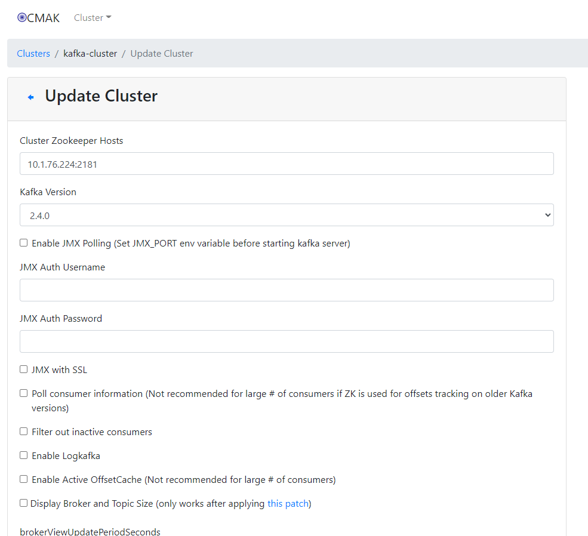
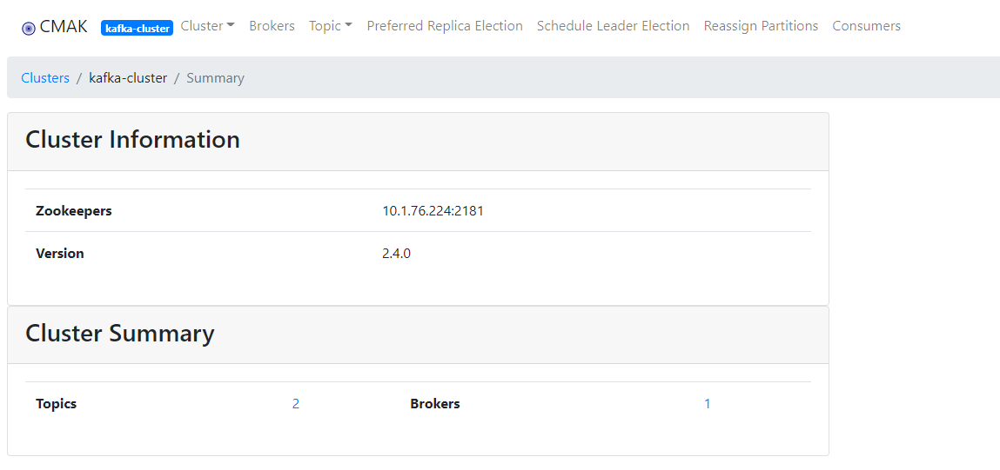
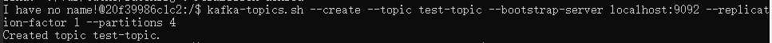
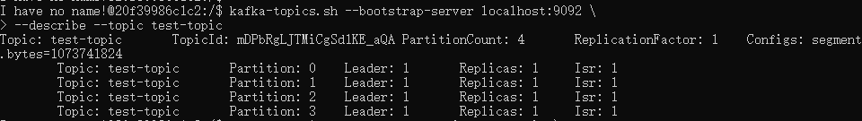
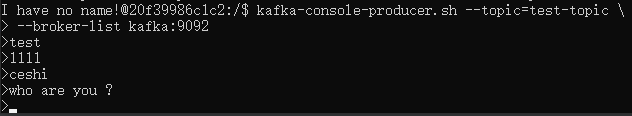
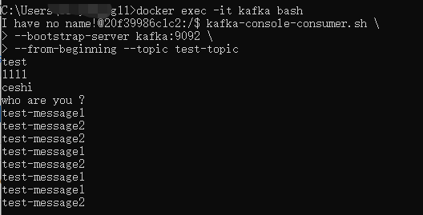
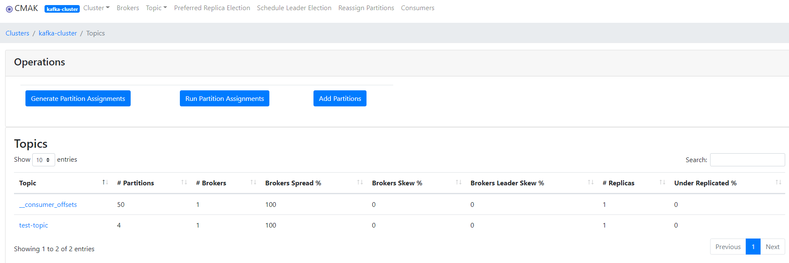

### 使用docker-compose 构建kafka，并使用springboot demo完成测试
1. 启动 `docker-compose up -d`
2. 开启管理控制台 http://localhost:9000/
- 新增kafka
  
  
3. 进入容器创建topic并测试
- 创建一个消费topic

`kafka-topics.sh --create --topic test-topic --bootstrap-server localhost:9092 --replication-factor 1 --partitions 4`

- 查看已创建的消费topic

`kafka-topics.sh --bootstrap-server localhost:9092 \
--describe --topic test-topic`

- 打开生产者生产消息

`kafka-console-producer.sh --topic=test-topic \
--broker-list kafka:9092`

- 新开一个窗口打开消费者消费监听消息

`kafka-console-consumer.sh \
--bootstrap-server kafka:9092 \
--from-beginning --topic test-topic`

**参考**：
https://www.lixueduan.com/post/kafka/01-install/
https://juejin.cn/post/7023586768368697375
