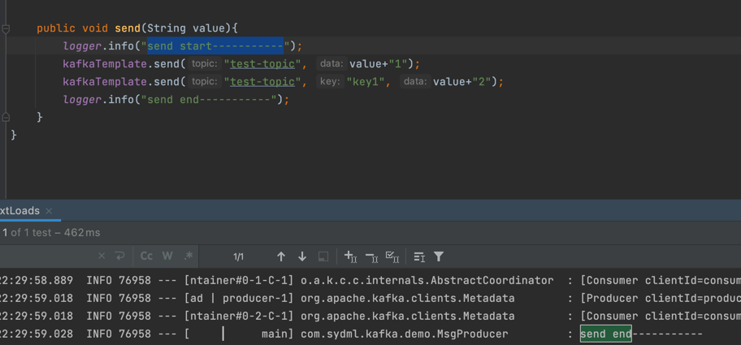

# docker：kafka单机及集群搭建及测试
**测试环境 macbook pro m1**
## 一、kafka单机版本
- 文件位置/src/main/resource/docker/docker-compose.yaml,使用是将ip换成本机的ip
#### 1. 启动 `docker-compose up -d`
   
#### 2. 开启管理控制台 http://localhost:9000/
- 新增kafka
  
  
#### 3. 进入容器创建topic并测试
- 创建一个消费topic

`kafka-topics.sh --create --topic test-topic --bootstrap-server localhost:9092 --replication-factor 1 --partitions 4`

- 查看已创建的消费topic

`kafka-topics.sh --bootstrap-server localhost:9092 --describe --topic test-topic`

- 打开生产者生产消息

`kafka-console-producer.sh --topic=test-topic --broker-list kafka:9092`

- 新开一个窗口打开消费者消费监听消息

`kafka-console-consumer.sh --bootstrap-server kafka:9092 --from-beginning --topic test-topic`

**参考**：
- https://www.lixueduan.com/post/kafka/01-install/
- https://juejin.cn/post/7023586768368697375
## 二、集群搭建
### 2.1 文件位置/src/main/resource/docker/docker-compose.yaml,使用是将ip换成本机的ip
#### 2.1.1 启动命令同上

### 2.2 修改代码
com.sydml.kafka.config.KafkaConsumerConfig
com.sydml.kafka.config.KafkaProducerConfig

### 2.2.1 启动后验证

